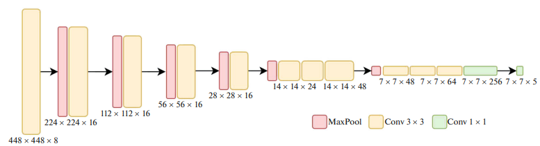
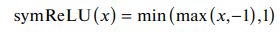
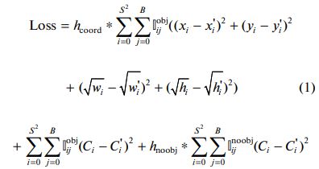

# Stamp Detection using Neural Network 
Detect stamp on document images using YOLO-Stamp architecture proposed in this <a href="https://link.springer.com/article/10.1134/S1054661822040046">paper</a>.  
Demo: https://huggingface.co/spaces/sadjava/stamp-detection

## Features
⚡ Object Detection  
⚡ YOLO-like architecture  
⚡ Paper implementation  
⚡ PyTorch Lightning  

## Limitations
❌ Does not correspond pixels to the object

## Table of Contents
- [Objective](#objective)
- [Dataset](#dataset)
- [Architecture](#architecture)
- [Evaluation Criteria](#evaluation-criteria)
- [Solution Approach](#solution-approach)

## Objective
I'll build a neural network using PyTorch. The goal here is to build a system to detect all stamps on a given image if there is one. 

## Dataset
- Dataset consists of 3,000 images and 6,000 stamps on them.
- For each image annotations were presented. They consist of height and width of image and list of bounding boxes for each stamp on the image.
- Each image in the dataset is an RGB image of arbitrary size.

## Architecture
I have implemented the architecture proposed in this <a href="https://link.springer.com/article/10.1134/S1054661822040046">paper</a>. Here is the architecture:

Image taken from <a href="https://link.springer.com/article/10.1134/S1054661822040046">paper</a>.  

Note: As authors I used symReLU activation functions.

## Evaluation Criteria

### Loss Function  
The YOLO loss function without classification loss was used, which holds balance between correct predicting of presence of stamp and its coordinates with shape. This following loss was used in the <a href="https://link.springer.com/article/10.1134/S1054661822040046">paper</a>, however I added weight coefficient to the second term ($h_{obj}$) to increase importance of detecting stamps.

Image taken from <a href="https://link.springer.com/article/10.1134/S1054661822040046">paper</a>.

### Performance Metric
`MeanAveragePrecision` is used as the model's performance metric on the val-set: `mAP@50=0.67` on the validation set was achieved during training.

## Solution Approach
- The part of data were collected manually and left part of the dataset was synthesized.
- The dataset was split on training and validation as 80% to 20%.
- The datasets are then wrapped in PyTorch `DataLoader` object so that we can iterate through them with ease. A `batch_size` can be configured.
- Training was held using PyTorch Lightning modules and trainer.

